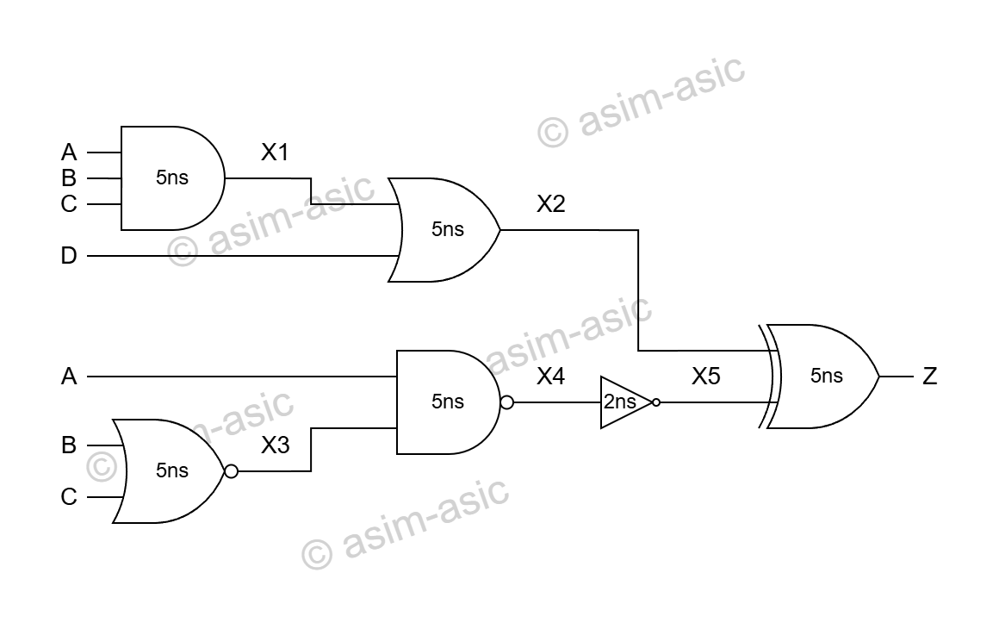

# Combinational Circuit – Verilogi

## Description
This project implements a combinational circuit in Verilog using continuous assignments.  
Each gate includes propagation delay.

## Circuit Diagram

## Files
- `comb_ckt.v` → Verilog design
- `tb_comb_ckt.v` → Testbench
- `comb_ckt.png` → Circuit diagram
- `README.md` → Project Documentation
- `note.txt` → Important observation while simulating

## License

This project is licensed under the MIT License.

© 2026 Asim Khan (asim-asic)
